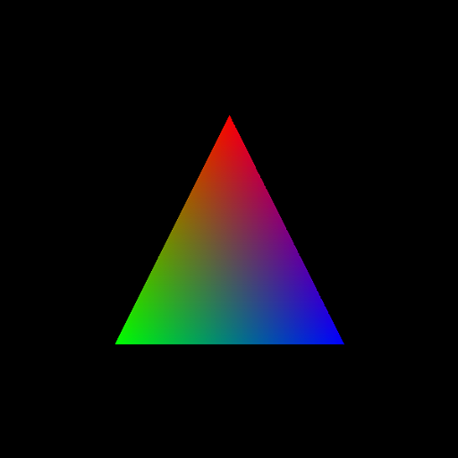

# WebRTX triangle example

This is the simplest example demonstrating the WebGPU Ray Tracing Extension ([WebRTX](https://www.github.com/codedhead/webrtx)).

## Building and running

```bash
npm install
npm run build
npm run serve
```



## Tutorial

The basic code structure is very similar to the triangle example in the dawn-ray-tracing project so you can follow most of the steps in this [article](https://maierfelix.github.io/2020-01-13-webgpu-ray-tracing/), but please be aware of the small differences in the two APIs.

The general initialization process includes

- Create geometries and instances.
- Create and build the acceleration structure.
- Create ray tracing pipeline with ray tracing shaders.
- Create shader binding table containing the shader function handles and parameters for current scene.
- Create render pipeline for presenting the pixel buffer filled by the ray tracing pipeline.
